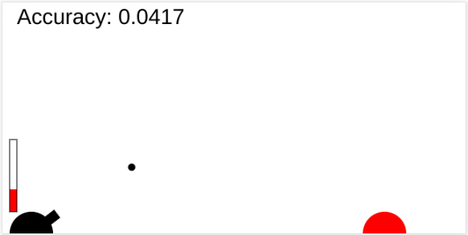

# Self Taught Neural Network

Watch a Neural Network learns how to shoot a target.

[Live version](https://victorribeiro.com/bangBangML)

## About

Halfway through creating a clone of the classic windows game [Bang Bang](https://archive.org/details/win3_BANGBANG) I realized I need a interesting Artificial Intelligence to play against the player. So I thought about having the opponent cannon be controlled by a Neural Network and learn how to shoot during run time. 

## Training

I came up with this algorithm to train the Neural Network. 

1 - Shoot it at random

2 - If the shot was to the left of the target, adjust the weights to the right and vice and versa. On this step I'm not saving the training data, as I don't care for a miss shot.

3 - After a hit, collect the data and use it to further train the Neural Network. This data is stored as it is a good example of how to shoot a target.  

## Application

I'm thinking about using different iterations of the trained Neural Network to use as a difficult level. Neural Networks trained for a short while would be the first opponents while the Neural Network that ware trained for a long period of time would come last, as a more hard opponent.
